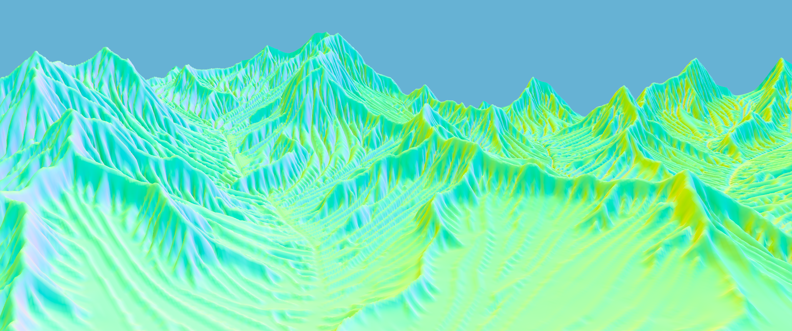

# Advanced multi-scale erosion

Source code for implementing advanced multi-scale erosion implemented in [Bevy](https://bevy.org/). It expands upon the paper [Terrain Amplification using Multi-scale Erosion](https://doi.org/10.1145/3658200).

## Prerequisites

The only prerequisite for running the app is [Rust](https://rust-lang.org/tools/install/).

## Running the app

Execute `cargo run`.

### Controls

- Left click: orbit camera
- Right click: pan camera
- Scroll wheel: zoom camera
- E: toggle erosion shader
- D: toggle deposition shader
- T: toggle thermal shader
- W: toggle wireframe view
- U: 2x upsampling (wireframe view must be off)

## Roadmap

- [x] Generate terrain from heightmap
- [x] Orbit camera
- [x] Wireframe rendering
- [x] Erosion compute shader
- [x] Deposition compute shader
- [x] Thermal compute shader
- [x] Compute shader composition
- [x] 2x upsampling
- [ ] Terrain tiling
- [ ] Dunes
- [ ] Yardangs
- [ ] Ventifacts
